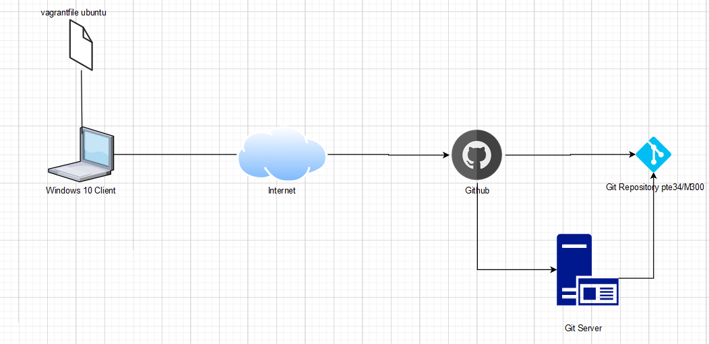

# M300 - LB2
## Linux

Linux ist ein Kernel, der für ein Betriebssystem zur Verfügung gestellt wird. Linux ist Open Source, deswegen kann man den Kernel erweitern.

Da ich im Geschäft mit Linux und Solaris arbeite, dokumentiere ich hier  ein paar basic-commands die ich häufig verwende:

* cd --> (change directory) Verzeichnis wird geändert
* ls --> (list) listet der Inhalt in einem Directory an
* pwd --> (print working directory) gibt den aktuellen "Standort" im Dateisystem aus
* mkdir --> (make directory) erstellt Verzeichnis
* rm --> (remove) löscht eine Datei (rmdir bei directory)
* chmod --> (change mode) ändert die Berechtigung
* nano / vi (Dateiname) --> (Anwendungen) öffnet ein Leeres Textfile, dass man bearbeiten kann
* df --> (disk free) zeigt wie viel Speicherplatz im Directory frei resp. besetzt ist 

Das sind natürlich nur ein paar wenige Basic Befehle, man kann diese natürlich auch weiter ausschmücken um effizienter zu arbeiten.

## Virtualisierung
### Was ist eine Virtuelle Maschine?

Eine Virtuelle Maschine, abgekürzt VM, ist ein Computer, so wie wir ihn kennen, nur dass er nicht auf seiner eigenen Hardware "sitzt". Eine VM ist einfach gesagt, ein Computer, der im Computer ist. Die VM bezieht seine Ressourcen vom phyischen Host. Damit VM und Host, im Bezug Ressourcen, zusammenspielen, ist der Hypervisor zuständig. Er ist Vermittler zwischen VM und Host. Der Hypervisor ist eine Software, welche wichtige Elemente, wie Arbeitsspeicher, Prozessor Netzwerkverbindungen und so weiter, an die VM(s) vermittelt.

Es wird dadurch ermöglicht, dass eine VM ein Betriebssystem, unabhängig vom Host-Betriebssystem, beheimaten kann. Das heisst, dass man ein Linux OS auf einem Windows Client mittels Vmware, Hyper-V, Virtualbox, etc. ,laufen lassen kann.

### Hypervisor

Der Hypervisor ist wie bereits erwähnt der Vermittler zwischen VM(s) und dem Host. Aber man muss beachten, es gibt 2 verschiedene Typen von Hypervisoren gibt.

#### Hypervisor Typ 1

Der Typ-1-Hypervisor beinhaltet kein Betriebssystem, er ist eigentlich das Betriebssystem selbst.

Als Beispiel bei Hyper-V, man meint man ist auf einem Windows-Host, wo der Hypervisor installiert ist, aber man ist bereits auf dem Hypervisor selbst.

#### Hypervisor Typ 2

Der Hypervisor Typ 2 ist ein Hypervisor, welcher auf dem Host-OS installiert ist.
Zum Beispiel VMWare oder Virtualbox, kann man als Windows-Client herunterladen und dort VMs hosten.

## Git
Git wurde von Linux-Gründer Linux Torvalds entwickelt. Es ist eine Versionenorientierte Applikation. Es macht es mehreren Benutzern möglich, eine einzelne Datei, gleichzeitig zu bearbeiten.

### Repository

Bei einem Git-Repository hat man als (Mit-)Bearbeiter mehrere Möglichkeiten, wie folgende:

* Die eigene Arbeit kann einfach wieder in die zentrale Basis integriert werden.
* Es kann zeitgleich weiterentwickelt werden, z.B. jeder an verschiedenen Features.
* Die Versionierung verhindert, dass bereits getätigte Arbeiten verloren gehen bzw. überschrieben werden.
* Bei Bedarf kann zu früheren Versionen zurückgekehrt werden oder simultan an verschiedenen Versionen gearbeitet werden (auch "Branches" genannt).

## Cloud Computing

Es gibt drei verschiedene Arten von Cloud Computing:

#### IaaS (Infrastructure as a Service)

IaaS ist eine Infrastruktur in der Cloud, welche man nutzen kann, um, als Beispiel, Virtuelle Maschinen zu verwalten. Diese Virtuelle Maschinen laufen dann auf dieser Infrastruktur.

#### PaaS (Platform as a Service)

PaaS ist eine Plattform für Entwickler, welche eine Plattform benützen, um zu entwickeln, dabei muss man sich keine Sorgen um die gesamte Infrastruktur machen.

#### SaaS (Software as a Service)

Software als ein Service, kann man sich so vorstellen; die Software muss nicht lokal auf einem Client installiert sein, sondern Eine Applikation, auf der Cloud, die nach aussen hin anbietet.

## Markdown
Markdown ist eine vereinfachte Auszeichnungssprache. Dass man diese Auszeichnungsprache ohne konvertierung lesen kann, war das Ziel, bei der Entwicklung von Markdown.

## Systemsicherheit
### Firewall
Die Firewall ist der Teil im Netzwerk, der das Netzwerk von anderen Netzen trennt. Sie bestimmt die Kommunikationswege. Ob Datenpakete ins Netzwerk rein oder aus dem Netzwerk raus gehen dürfen, entscheidet die Firewall. Das entscheidet sie an der Source, Destination, dem Port und dem Protokoll.

Es gibt folgende Firewall-Typen:

* Application Layer Firewall / Layer 7 – Firewall: Filterung nach Daten-Inhalt → Proxy
* Personal Firewall -->  auf Host lokal die Kommunikation nach Regeln zulässt oder nicht (z.B. Windows Firewall, Comodo Firewall, Avira, Kaspersky ect. )

### Reverse Proxy
Ein (Reverse-)Proxy kann man als Stellvertretter eines Rechners sehen. Er leitet die Datenpakete an den Rechner in einem Netz weiter. Heisst der aussenstehende Rechner merkt nicht, dass er nicht mit dem Zielrechner "spricht", sondern eben mit dem (Reverse-)Proxy.

## Vagrant
### Was ist Vagrant?

Vagrant ist ein Programm, mit welchem man sehr einfach und effizient Virtuelle Maschinen erstellen kann. Anhand eines Files, des Vagrant Files, lassen sich Konfigurationen an den VM's und Informationen für die Hypervisoren anpassen. Durch die Commands von Vagrant lassen sich die VM's ganz einfach erstellen, booten & löschen.

Als Beispiel hier ein paar Commands:

> <"vagrant Init">  -->    #Erstellt VM

> <"vagrant up">    -->    #Startet VM

> <"vagrant ssh">   -->    #Verbindung per SSH zur VM

> <"vagrant status"> -->   #Status der VM

> <"vagrant port">  -->    #Anzeige weitergeleitete Ports der VM 

> <"vagrant halt">  -->    #stoppt VM

> <"vagrant destroy"> -->  #Löscht die VM

Weitere Informationen zu Vagrant unter diesem [Hyperlink](https://www.vagrantup.com/)

### Vagrant in der Praxis
#### Einleitung

Ich beziehe mich in dieser Aufgabe auf das Bewertungsraster der LB2 im BSCW.
Es geht in dieser Aufgabe darum eine Vagrant VM aufzusetzen. Diese VM wird auf das Vagrantfile zurückgreifen, um die Konfigrationen auszulesen.

#### Umgebung

Meine Umgebung soll folgendermassen funktionieren:

Das Repository ist lokal gespeichert und alles was lokal verändert wird, wird mit einem git push auf das GitHub Repository "gepusht".

Ich habe in diesem Repository unter dem Ordner "LB2/ubuntu" ein Vagrant File erstellt, wo sich die VM befindet.

Den Ordner habe ich ganz einfach Lokal erstellt.
Anschliessend habe ich in git bash in diesem Ordner folgenden vagrant Befehl eingegeben:

> vagrant init ubuntu/trusty64

Das File wurde also erstellt. In diesem File befinden sich die Konfigurationen der VM. Diese Konfigurationen sind in fünf Punkte aufgeteilt, diese sind logischerweise in dem vagrant file zu finden.

* config.vm.box --> OS der VM
* config.vm.provider --> Provider/Hypervisor
* config.vm.network --> Netzwerkkonfigurationen
* config.vm.synced_folder --> Konfigurationen mit Filezugriff
* config.vm.provision --> Konfiguration zum automatisiertes Aufsetzen

Wenn man diese Konfigurationen bearbeitet hat, kann man die VM unter dem richtigen Pfad mit folgendem Command starten:

> vagrant up

Die VM wird nun gestartet und liest dabei die Konfiguration aus dem Vagrant File aus.
Nach dem Start kann man auf sie, per SSH zugreifen.

> vagrant ssh

Man ist jetzt auf der VM.

### Testing

| Testfall                      | Check          |
| --------                      | -------------- |
| SSH Zugriff                   | ja             |
| Programme installiert         | ja             |
| Berechtigungen stimmen        | ja             |
| User erfolgreich erstellt     | ja             |
| Firewall rules stimmen        | ja             |

### Sicherheit

Ich habe als Sicherheitsmassnahmen für meine VM folgende getroffen:

* Berechtigungen für die User auf bestimmte Ordner
* Firewall
* Reverse-Proxy (für den Apache-Webserver)

Danach würde es noch weitere geben, die nicht mit meiner VM spezifisch etwas zu tun haben:

* User auf dem neusten Stand halten (Schulungen)
* laufend Dokumentieren (In einer Doku (GitHub wegen Versionenbasiert) oder Knowledge-Database)

## Kreativität LB2

Ich habe für den Punkt "Kreativität" ein Bash-Script erstellt, wo sich das Vagrantfile die (meisten) Konfigurationen her holt.

## Wissenszuwachs

Ich muss sagen, ich hatte anfangs ein wenig Probleme mich mit dem Thema zu beschäftigen, ich wusste mich selbst nicht wirklich zu orientieren. Ich hatte zuvor noch keine Ahnung, wie Github funktioniert, was vagrant ist. Durch die LB2 konnte ich einiges lernen

## Reflexion

Wie schon erwähnt, hatte ich anfangs keinen Plan, wie ich mich in diesem Modul orientieren muss. Ich denke, es hatte damit zu tun, dass ich mich in GitHub nicht gut zurecht fand, aber da ich dann angefangen habe, es langsam zu verstehen, kam die LB2 langsam ins Rollen, es hat bei mir zwar etwas länger gedauert, aber unzufrieden bin ich nicht, mit dem was ich (innert kurzer Zeit) gelernt habe. 

# M300-LB3
## Containerisierung

Containerisierung ist eine Art von Virtualisierung auf Anwendungsebene. Bei dieser Art von Virtualisierung werden mehrere isolierte Maschinen (Container) auf einem einzelnen Kernel ausgeführt.

Container bieten eine Standardmethode um Anwendungscode, Laufzeitumgebung, Systemwerkzeugen, Systembibliotheken und Konfigurationen in einer Maschine zusammenzufassen. Im Gegensatz zu VMS, die alle ihren eigenen "Kernel" haben, teilen sich Container einen Kernel (Betriebssystem), der auf der Hardware installiert ist.

#### Unterschied VM & Container

## Docker

Docker ist eine Software, welche die Isolation von Anwendungen, mithilfe Containervirtualisierung lizenzfrei bereitgestellt wird.

Docker hat mehrere "Elemente", welche unterschiedliche Aufgaben übernehmen.

#### Docker Deamon
* Erstellt, Überwacht und führt Container aus
* Baut und Speichert das Docker-Image

#### Docker Client
* "Kommandozeile" von Docker

#### Docker-Images
* Können als Container gestartet werden
* Unveränderbar, man kann neu gebuildete Images als Container starten

#### Container
* Images welche ausgeführt werden
* Ein Image kann man mehrmals als Container ausführen

#### Registry
* Images werden dort abgelegt

### Microservices

Microservices sind ein Architekturkonzept der Anwendungsentwicklung. Ein Microservice ist also eine Kernfunktion einer Anwendung und er wird unabhängig von anderen Services ausgeführt.

Jede Funktion kann unabhängig entwickelt und implementiert werden.

### Docker in der Praxis

In diesem Projekt geht es darum, Docker besser kennen zu lernen. Ich werde Container erstellen, diese Kombinieren und managen.

#### Umgebung

(Insert Pic)

#### Docker installation

Um mit Docker zu arbeiten muss man Docker erstmal installieren. Dies geschieht auf einer Ubuntu VM.

Ich habe Docker mit dieser [Anleitung](https://www.digitalocean.com/community/tutorials/so-installieren-und-verwenden-sie-docker-auf-ubuntu-18-04-de) installiert.

Testen, ob man Docker korrekt installiert hat, kann man mit folgenden commands:

> sudo systemctl status docker

> sudo docker run hello-world

Weitere Docker-Befehle:

Container (welche laufen) anzeigen

> docker ps

Container anzeigen

> docker container ls -a

Images anzeigen

> docker images

Image herunterladen

> pull (Imagename)

Image erstellen

> docker image build -t

Container stoppen

> docker container stop [ID]

auf spezifischen Container zugreifen

> docker container exec -it "Containername" bash

#### Image

Ich habe für die LB3 ein bestehendes Image genommen.

> docker container run -d -p 8080:80 nginx -v $(pwd):/usr/share/nginx/html --name nginx-website nginx

Ich habe einen Test Ordner erstellt. Im Command ist das "$(pwd)" zu finden, und das ist dafür da, dass dieser Ordner in dem man sich gerade befindet, gemeint ist.

Im Testordner habe ich nun ein index.html file erstellt, welches das Original überschreibt. Diese Änderungen geschehen allem im Container.

Im Dockerfile habe ich definiert, mit welchem Image ich arbeite, wo meine Workdirectory ist und, dass das Image alle Inhalte von der Workdirectory in mein Image kopieren soll.

Als nächstes geht es darum, das Image zu "bauen". Dies macht man mit folgendem Command:

> docker image build -t terrypeterm300/nginx-website .
 
Nun ist das Image lokal verfügbar, und man kann bereits mit dem einen Container erstellen. Jedoch möchte ich, dass ich das von jedem Computer aus machen kann. Also pushe ich das noch von meinem Dockerhub Account.

> Docker push seanm300/nginx-website

mit dem Command: 
> Docker login

Kann man sich auf Docker Hub anmelden.

### Test

| Testfall                      | Check          |
| --------                      | -------------- |
| Container wird angezeigt      | ja             |
| Webseite erreichbar           | nein           |
| Ports sind nicht besetzt      | ja             |
| Applikation erreichbar        | nein           |
| Image Docker Hub erreichbar   | ja             |
| Image funktioniert            | ja             |

### Sicherheit

Ich habe folgende weitere Sicherheitsaspekte für meine Container realisiert:

#### Speicher
Wenn man den Speicher schützt, kann man die Chancen von DDos Attacken minimieren. Dies ist wichtig, da der Speicher nicht "aufgefressen" werden darf. Hier wäre der Command dazu:

#### Neustarts begrenzen
Ein Neustart verhindert Zeitverluste und Ressorcenverluste von einem sterbenden Container. Auch hier kann eine DDos Attacke verhindert werden.

#### Ressourcen einschränken

Der Linux-Kernel definiert eine Reihe von Berechtigungen, welche Prozessen zugewiesen werden können, um ihnen einen erweiterten Zugriff auf das System zu gestatten.

Die Capabilities decken einen grossen Funktionsbereich ab, vom Ändern der Systemzeit bis hin zum Öffnen von Netzwerk-Sockets.

## Reflexion

Die LB3 von diesem Modul habe ich einen guten Einblick in die Welt der Container erhalten. Ich weiss jetzt wie man mit Docker sehr schnell Services zum laufen bringt und diese auch verwalten kann.

